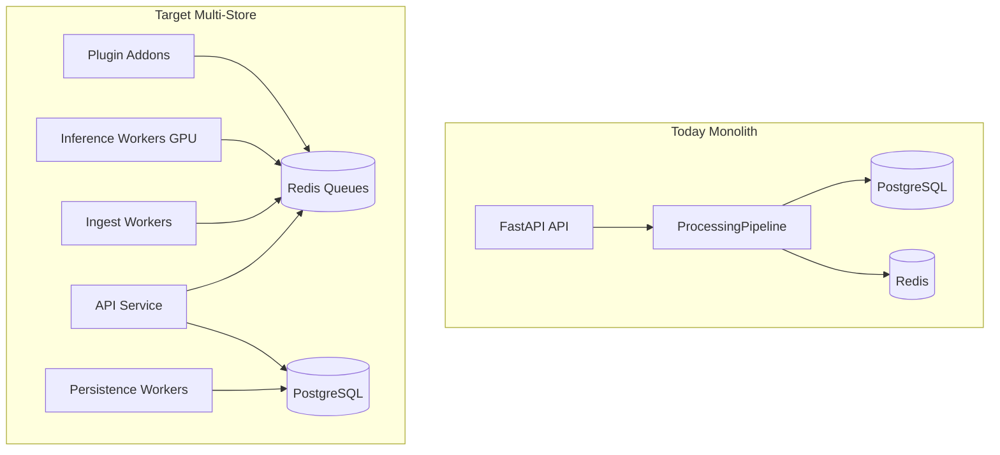
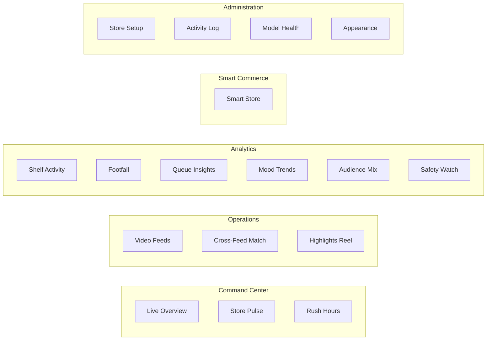
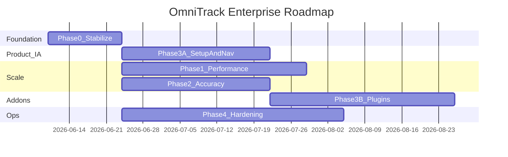

# OmniTrack AI — Enterprise Roadmap & Implementation Brief

**Single reference document** for performance, accuracy, product IA, Setup Hub, addons, and enterprise hardening.

**Repo:** https://github.com/Gustav1814/OMNI-TRACK.git  
**Target:** Multi-store rollout, **16+ cameras per site**, dedicated inference server, **zone-aware smart ensemble**

---

## Table of contents

1. [What OmniTrack does](#1-what-omnitrack-does)
2. [Tech stack & architecture](#2-tech-stack--architecture)
3. [Current state & gaps](#3-current-state--gaps)
4. [Frontend page audit](#4-frontend-page-audit)
5. [Phase 3A — Product IA & Setup Hub](#5-phase-3a--product-ia--setup-hub)
6. [Phase 0 — Stabilize accuracy](#6-phase-0--stabilize-accuracy)
7. [Phase 1 — Performance (16+ cameras)](#7-phase-1--performance-16-cameras)
8. [Phase 2 — Accuracy at scale](#8-phase-2--accuracy-at-scale)
9. [Phase 3B — Enterprise addons](#9-phase-3b--enterprise-addons)
10. [Phase 4 — Production hardening](#10-phase-4--production-hardening)
11. [Execution order & success metrics](#11-execution-order--success-metrics)
12. [Environment variables](#12-environment-variables)
13. [API surface summary](#13-api-surface-summary)
14. [Implementation checklist](#14-implementation-checklist)
15. [Hardware guidance](#15-hardware-guidance)

---

## 1. What OmniTrack does

**OmniTrack AI** is a retail computer-vision analytics platform: it ingests live CCTV (or video files), runs a multi-camera AI pipeline (detect → track → re-identify → analyze), persists results to PostgreSQL/pgvector, and exposes a React executive dashboard.

### Business value

1. **Live surveillance intelligence** — RTSP/webcam/file feeds; person detection; per-camera tracking; cross-camera Re-ID (`global_id` e.g. `PERSON-00042`)
2. **Retail analytics** — Crowd density, shelf dwell, checkout queues, emotion trends, fire/smoke alerts, demographics, peak hours, aggregated “store vibe”
3. **Video tools** — Synopsis highlights, footage upload/playback
4. **Security** — JWT auth (admin/operator/viewer), AES-256 metadata encryption, SHA-256 chained audit logs
5. **Humanless / cashierless store** — Re-ID sessions → virtual carts → loss-prevention alerts → simulated checkout (API + DB exist; vision wiring partial)

### Data flow

```
Cameras (RTSP / video file)
  → StreamManager (per-camera capture, threaded, bounded queue)
  → ProcessingPipeline (central tick)
      1. YOLO detection (per-feed model / zone-smart ensemble)
      2. ByteTrack per-camera track IDs
      3. Global Re-ID gallery (512-d embeddings, cosine match)
      4. Gated analytics (shelf, crowd, checkout, emotion, fire)
      5. Store Vibe aggregator
  → PersistencePipelineCallback → PostgreSQL
  → WebSocket / REST → React dashboard
```

**Core file:** `backend/app/services/pipeline.py`

---

## 2. Tech stack & architecture

| Layer | Technology |
|--------|------------|
| API | FastAPI (`backend/app/main.py`), Uvicorn :8000 |
| DB | PostgreSQL 16 + pgvector (HNSW on embeddings) |
| Cache | Redis (optional; in-memory fallback) |
| CV/ML | YOLOv8/v11, ByteTrack, Torchreid (OSNet), OpenCV, optional DeepFace |
| Frontend | React 18 + Vite (:5173), proxies `/api` and `/ws` |
| Realtime | WebSockets `/ws/live`, MJPEG `/api/stream/camera/{id}/live` |
| Deploy | Docker Compose: postgres, redis, backend, frontend; optional nginx |

### Target enterprise architecture (multi-store)



### Project layout

```
OMNI-TRACK/
├── backend/app/
│   ├── ai/              # detector, tracker, reid, emotion, fire, crowd, shelf, checkout, vibe
│   ├── models/          # SQLAlchemy + humanless.py
│   ├── routers/         # auth, cameras, detection, reid, analytics, humanless, model, footage
│   ├── services/        # pipeline.py, persistence, humanless_store, cache, stream_manager
│   ├── plugins/         # PluginManager + ENABLED_PLUGINS hooks
│   └── main.py
├── frontend/src/
│   ├── pages/           # 18 route-level pages
│   ├── components/      # Sidebar, CameraStream, StatCard, StatusTile, etc.
│   └── services/api.js
├── docs/
│   ├── dev/SCALABILITY_AND_PLUGIN_BASE.md
│   └── dev/DATABASE_ENTERPRISE_BASE.md
└── docker-compose.yml
```

---

## 3. Current state & gaps

### Performance bottlenecks

| Issue | Impact |
|-------|--------|
| `MAX_CAMERAS=8`, `PROCESSING_FPS=6` | Hard cap below 16-camera target |
| `MAX_PARALLEL_CAMERA_PROCESSORS=2` | 16 cams = 8 waves per tick → lag |
| `INFERENCE_BATCH_SIZE` unused | No true cross-camera YOLO batching |
| Global `_model_inference_lock` | Serializes all model forward passes |
| Re-ID on CPU when `DEVICE=auto` | Major GPU underuse |
| Per-tick DB writes (detections/embeddings) | DB pool pressure |
| `MemoryGuard` not started | No runtime degradation |
| Phase 3 analytics sequential | Fire/emotion block tick |

### Accuracy strengths

- Re-ID: hysteresis, blind-spot pool, deterministic cam order, pgvector warm-up
- Ensemble merge: confidence-weighted boxes, `ensemble_agreement`
- Adaptive gating: zone keywords, fire idle/active cadence, camera roles
- Fire: never mocks; refuses generic YOLO for fire alerts

### Accuracy weak points

- Default `yolov8n.pt` (low recall in crowds)
- `MAX_REID_DETECTIONS_PER_FRAME=8` caps crowd Re-ID
- pgvector not used for live gallery search (in-memory O(n))
- Emotion: Haar → neutral stub
- Analytics API demo fallbacks when pipeline idle
- `auto_ensemble` should use zone-smart pick (2 weights), not all weights

### Enterprise infra gaps

| Exists | Missing |
|--------|---------|
| JWT, partial RBAC, audit chain, Docker | SSO/MFA, token revoke, consistent RBAC |
| `/api/health`, Loguru logs | Prometheus, OTel, Sentry |
| Plugin hooks, `ENABLED_PLUGINS` | Shipped reference plugins |
| Alembic, retention on startup | Scheduled retention cron, CI/tests |
| Lazy-loaded React pages | Role-based nav, Setup Hub, orphan pages linked |

---

## 4. Frontend page audit

| Route | Page | Sidebar | Issue |
|-------|------|---------|-------|
| `/` | DashboardPage | Yes | OK |
| `/vibe` | VibePage | Yes | OK |
| `/detection` | DetectionPage | Yes | Bloated — humanless setup embedded |
| `/reid` | ReIDPage | Yes | OK |
| `/synopsis` | SynopsisPage | Yes | OK |
| `/trim` | — | No | Redirects to `/synopsis` |
| `/shelf` | ShelfPage | Yes | OK |
| `/fire` | FirePage | Yes | OK |
| `/crowd` | CrowdPage | Yes | OK |
| `/checkout` | CheckoutPage | Yes | OK |
| `/peak-hours` | PeakHoursPage | Yes | OK |
| `/demographics` | DemographicsPage | Yes | OK |
| `/emotion` | EmotionPage | **No** | Orphan — built, API live |
| `/audit` | AuditPage | **No** | Orphan — hash chain UI |
| `/security` | SecurityPage | **No** | Orphan — adversarial eval |
| `/humanless` | — | No | Redirects to `/` |
| `/settings` | SettingsPage | Yes | Appearance only |

**Also broken:** `TopBar` Refresh/Start Session not wired; `CommandPalette` missing half the routes.

---

## 5. Phase 3A — Product IA & Setup Hub

**Duration:** 3–4 weeks  
**Goal:** Every page linked; setup centralized; Detection = ops only.

### 5.1 Target navigation (5 sections + roles)



| Section | admin | operator | viewer |
|---------|-------|----------|--------|
| Command Center | full | full | read-only |
| Operations | full | full | read-only, no start/stop |
| Analytics | full | full | full |
| Smart Commerce | full | full | read-only |
| Setup | full | products/zones | hidden |
| Audit / Security | full | read-only | hidden |
| Settings | full | full | appearance |

**Files:** `frontend/src/components/Sidebar.jsx`, `App.jsx`, new `useUserRole()` hook

### 5.2 Setup Hub — `/setup`

**New:** `frontend/src/pages/SetupPage.jsx`  
**Routes:** `/setup`, `/setup/products`, etc.

#### Tab 1 — Store profile (deployment templates)

| Template ID | Label | Modules | Default zones |
|-------------|-------|---------|---------------|
| `convenience` | Convenience / Small format | crowd, checkout, fire, vibe | entrance, aisle, checkout |
| `supermarket` | Supermarket / Grocery | all except humanless | entrance, aisles, shelf, checkout, storage |
| `humanless` | Cashierless / Smart store | humanless, reid, shelf, checkout, loss-prevention | entrance, shelf, checkout |
| `big_box` | Big box / Warehouse club | crowd, peak-hours, demographics, shelf | entrance, main floor, checkout |
| `fuel_forecourt` | Fuel & forecourt | fire, safety, limited crowd | forecourt, entrance |
| `custom` | Custom enterprise | manual module toggles | user-defined |

**Backend (new):**
- `backend/app/models/store_profile.py` — `deployment_type`, `store_name`, `enabled_modules` (JSON), `zone_templates` (JSON), `setup_completed_at`
- `backend/app/routers/setup.py` — `GET/PUT /api/setup/profile`, `GET /api/setup/templates`
- Migration `003_store_profile.py`

#### Tab 2 — Products & catalog
- Move CRUD from `DetectionPage.jsx` → `humanlessAPI`

#### Tab 3 — Shelf zones & planogram
- Zone map, product link, bbox editor, stock thresholds

#### Tab 4 — Cameras & zones
- `camerasAPI` CRUD, link to Video Feeds, per-camera model override

#### Tab 5 — Models & detection policy
- `modelAPI.list()`, zone-smart ensemble rules, template defaults

#### Tab 6 — Integrations & alerts
- Webhooks, POS export, plugin list from `/api/health`

#### Tab 7 — Users & access (admin)
- User roles, link to `/admin`, `DISABLE_REGISTER` status

**First-run wizard:** Redirect new admin to `/setup?wizard=1` if `setup_completed_at` is null.

### 5.3 Smart Store page — `/humanless`

**New:** `frontend/src/pages/HumanlessStorePage.jsx`

- KPIs: open carts, subtotal, alerts, sessions
- Cashier queue, session cards, alert review, cart inspector
- Manual cart event (operator override)
- **Remove** product/zone forms from DetectionPage

### 5.4 Link orphans & wire chrome

| Action | File |
|--------|------|
| Add emotion, audit, security, humanless, setup to sidebar | `Sidebar.jsx` |
| Routes + pageTitles | `App.jsx` |
| Full route list | `CommandPalette.jsx` |
| Wire Refresh, Start Session, Health, WS state | `TopBar` in `App.jsx` |
| Dashboard deep-links | `DashboardPage.jsx` |

### 5.5 Component distribution

| Concern | Page |
|---------|------|
| Executive KPIs | Dashboard |
| Live video + pipeline | Detection |
| Store journey | ReID |
| Commerce ops | Humanless |
| Catalog / zones / cameras / models | Setup (tabs) |
| Mood / compliance / ML health | Emotion / Audit / Security |
| Look & feel | Settings |

**Exit criteria:** 18/18 routes in nav; Setup wizard works; Detection has no catalog CRUD.

---

## 6. Phase 0 — Stabilize accuracy

**Duration:** 1–2 weeks

1. **Zone-aware smart ensemble** — `auto_ensemble` → `_select_smart_weight_names()` (max 2 weights by zone); keep `auto_all` for brute-force all weights
2. **Wire ignored config** — `NMS_THRESHOLD`, Re-ID `device=auto`, `MemoryGuard` in lifespan, `HEAVY_ANALYTICS_INTERVAL`
3. **Accuracy presets** in `.env.example` (crowded vs precision profiles)
4. **No silent mocks** — gate `reid_backend` random embeddings; `demo: true` on idle analytics

**Files:** `detection.py`, `pipeline.py`, `detector.py`, `main.py`

---

## 7. Phase 1 — Performance (16+ cameras)

**Duration:** 3–5 weeks

1. Config: `MAX_CAMERAS=24`, `PROCESSING_FPS=10`, `MAX_PARALLEL_CAMERA_PROCESSORS=4`, `MAX_REID_DETECTIONS_PER_FRAME=16`
2. **True batched inference** — use `INFERENCE_BATCH_SIZE`; cross-camera `predict(batch)`
3. Parallelize Phase 3 analytics (`asyncio.gather`)
4. JPEG preview tier — encode only visible dashboard feeds
5. **Write-behind persistence** — bucket detections; Redis queue → pgvector flush
6. **Load shedding** — drop emotion/demographics first; priority by camera role
7. RTSP substream + ROI crop (Setup tab 4)

**Exit criteria:** 16 cams ≥8 FPS; p95 tick <120ms; DB writes −60%.

---

## 8. Phase 2 — Accuracy at scale

**Duration:** 3–4 weeks

1. **Model tiers** — nano (edge), standard (yolov8m/yolo11m), specialist (fire_smoke.pt, product.pt)
2. **Ensemble per template** — entrance: 2 person detectors; safety: fire+person; shelf: product+person
3. **pgvector live HNSW search** when identities >1000
4. **ROI bbox UI** in Setup tabs 3–4
5. **Production emotion** — DeepFace behind `ENABLE_EMOTION`; disable demo analytics in prod

**Tune presets:**

High recall (crowded):
```
DETECTION_CONFIDENCE=0.45
MAX_REID_DETECTIONS_PER_FRAME=16
PROCESSING_FPS=12
DEFAULT_SKIP_FRAMES=0
ENSEMBLE_MIN_MODEL_AGREEMENT=1
```

High precision (loss prevention):
```
DETECTION_CONFIDENCE=0.6
ENSEMBLE_MIN_MODEL_AGREEMENT=2
REID_SIMILARITY_THRESHOLD=0.72
REID_STRONG_SWITCH_MARGIN=0.18
```

---

## 9. Phase 3B — Enterprise addons

**Duration:** 4–6 weeks

### Plugin contract (`ENABLED_PLUGINS` in `.env`)

```python
# Module may expose:
router = APIRouter(prefix="/api/plugins/...")
def setup(context): ...
async def on_startup(context): ...
async def on_pipeline_results(results, global_state): ...
async def on_lifecycle(event, payload): ...
```

### Reference addons (`backend/app_plugins/`)

| Addon | Purpose |
|-------|---------|
| `loss_prevention` | Pipeline → CartEvent + alerts from shelf dwell |
| `pos_bridge` | Checkout export to POS (CSV/JSON/webhook) |
| `alert_dispatcher` | Slack/Teams/email (configured in Setup tab 6) |
| `metrics_exporter` | Prometheus `/metrics` |
| `retention_scheduler` | Cron retention without restart |
| `store_profile` | Load template → enable modules on startup |

### Humanless vision wiring

- `StoreSession` on first `global_id`
- `CartEvent` from shelf zone dwell + confidence
- Respect `StoreProfile.enabled_modules`

---

## 10. Phase 4 — Production hardening

**Duration:** 4–6 weeks (parallel with Phase 0+)

### Security
- JWT revoke + Redis denylist; logout endpoint
- `DISABLE_REGISTER`; RBAC on pipeline, setup, exports, audit
- TLS in `nginx.conf`; reject default secrets at startup
- Encrypt RTSP credentials in `cameras` table

### Observability
- Prometheus metrics; structured JSON logs; optional Sentry
- Grafana dashboard template

### Operations
- GitHub Actions (lint, pytest smoke, Docker build)
- Retention cron; backup/restore runbook
- Compose resource limits

### Service split (when Phase 1 maxed)
1. API service (auth, CRUD, WS, plugins)
2. Inference worker (GPU shard per camera group)
3. Persistence worker (Redis → PostgreSQL)

### Multi-store tenancy (future)
- `store_id` on profile, cameras, sessions
- Per-store Setup scope; central admin across sites

---

## 11. Execution order & success metrics



**Recommended:** Run **Phase 3A parallel with Phase 0** for fastest product impact.

| Metric | Current | Target |
|--------|---------|--------|
| Pages in nav | 11/18 | 18/18 |
| Orphan routes | 4 | 0 |
| Setup centralized | DetectionPage | `/setup` hub |
| Store templates | 0 | 6 |
| Role-based nav | No | Yes |
| Cameras / node | 8 | 16–24 |
| Effective FPS / cam | 4–6 | 8–10 |
| p95 pipeline tick | 250–400ms | <120ms |
| Plugin addons | 0 | ≥3 |

---

## 12. Environment variables

### Pipeline & performance (`backend/app/config.py`)

| Variable | Default | Role |
|----------|---------|------|
| `MAX_CAMERAS` | 8 → **24** | Camera registration cap |
| `PROCESSING_FPS` | 6 → **10** | Pipeline tick rate |
| `MAX_PARALLEL_CAMERA_PROCESSORS` | 2 → **4** | Concurrent detection |
| `INFERENCE_BATCH_SIZE` | 2 | **Implement batching** |
| `DEFAULT_SKIP_FRAMES` | 2 | Capture decimation |
| `FRAME_BUFFER_SIZE` | 2 | Drop-old queue depth |
| `MAX_REID_DETECTIONS_PER_FRAME` | 8 → **16** | Re-ID crop cap |
| `ENABLE_ADAPTIVE_MODEL_GATING` | true | Module cadence/zone gating |
| `REID_INTERVAL_FRAMES` | 5 | Re-ID refresh cadence |
| `FIRE_ACTIVE_INTERVAL_FRAMES` | 12 | Fire when people present |
| `FIRE_IDLE_INTERVAL_FRAMES` | 45 | Fire when empty |
| `SHELF/EMOTION/CHECKOUT_*_INTERVAL_FRAMES` | 3/12/3 | Per-module cadence |
| `ENSEMBLE_NMS_IOU_THRESHOLD` | 0.50 | Inter-model merge |
| `ENSEMBLE_MIN_MODEL_AGREEMENT` | 1 | Set 2 for precision |
| `ALLOW_MOCK_AI` | false | No fake detections |
| `DEVICE` | auto | cuda/cpu/mps |

### Re-ID tuning

| Variable | Default | Notes |
|----------|---------|-------|
| `REID_SIMILARITY_THRESHOLD` | 0.6 | Raise → precision |
| `REID_RECENT_MATCH_THRESHOLD` | 0.48 | Occlusion recovery |
| `REID_STRONG_SWITCH_MARGIN` | 0.14 | Anti-flicker |
| `REID_BLIND_SPOT_TIMEOUT_S` | 300 | Disappeared pool |
| `REID_GALLERY_MAX_IDENTITIES` | 5000 | LRU cap |

### Infrastructure

| Variable | Role |
|----------|------|
| `DATABASE_URL` | PostgreSQL + pgvector |
| `REDIS_URL` | Cache, queues, rate limit |
| `REQUIRE_DATABASE` / `REQUIRE_REDIS` | Startup gates |
| `ENABLED_PLUGINS` | JSON list of plugin modules |
| `JWT_SECRET_KEY` / `AES_SECRET_KEY` | **Change in prod** |

---

## 13. API surface summary

| Area | Prefix | Examples |
|------|--------|----------|
| Auth | `/api/auth` | login, register, me |
| Cameras | `/api/cameras` | CRUD |
| Detection | `/api/detection` | start/stop, status, recording |
| Humanless | `/api/humanless` | products, zones, carts, sessions, alerts |
| Re-ID | `/api/reid` | search, journey, active |
| Models | `/api/models` | list weights, classes |
| Pipeline | `/api/pipeline` | status, start, stop, results |
| Analytics | `/api/shelf`, `/fire`, `/crowd`, etc. | feature endpoints |
| Setup | `/api/setup` | **NEW** profile, templates |
| Health | `/api/health` | DB, pipeline, plugins |
| WebSocket | `/ws/live` | live dashboard |
| Admin | `/admin` | SQLAdmin panel |

---

## 14. Implementation checklist

### Phase 3A (Product IA) — start here
- [ ] `useUserRole()` + filtered `Sidebar.jsx` (5 sections)
- [ ] Routes: `/setup`, `/humanless`; link `/emotion`, `/audit`, `/security`
- [ ] `SetupPage.jsx` — 7 tabs + store template cards
- [ ] `HumanlessStorePage.jsx` — ops dashboard
- [ ] `store_profile` model + `setup.py` router + migration 003
- [ ] Strip setup forms from `DetectionPage.jsx`
- [ ] Wire `TopBar` + expand `CommandPalette.jsx`
- [ ] First-run setup wizard + dashboard banner

### Phase 0 (Stabilize)
- [ ] Zone-smart `auto_ensemble` in `detection.py`
- [ ] Re-ID GPU auto; NMS_THRESHOLD wired; MemoryGuard started
- [ ] Demo flags on idle analytics; mock embedding gate

### Phase 1 (Performance)
- [ ] Cross-camera batched YOLO
- [ ] Write-behind persistence
- [ ] Load shedding + parallel analytics
- [ ] Config uplift for 16–24 cameras

### Phase 2 (Accuracy)
- [ ] Model tier docs + weights in `model_weight/`
- [ ] pgvector live search
- [ ] ROI editor in Setup
- [ ] Production emotion path

### Phase 3B (Addons)
- [ ] `app_plugins/loss_prevention`, `alert_dispatcher`, `metrics_exporter`
- [ ] Pipeline → humanless CartEvent wiring

### Phase 4 (Hardening)
- [ ] JWT revoke, RBAC, TLS, Prometheus, CI/CD
- [ ] Multi-store tenancy design

---

## 15. Hardware guidance

**16+ camera inference server (minimum):**
- NVIDIA RTX 4060 16GB or A4000
- 32GB RAM, NVMe SSD
- 1Gbps VLAN for camera traffic

**Recommended:**
- RTX 4080 / A5000, 64GB RAM
- Dedicated PostgreSQL 16 + pgvector
- Redis required (`REQUIRE_REDIS=true`)

**Run locally:**
```bash
docker compose up -d postgres redis
cd backend && uvicorn app.main:app --reload --host 0.0.0.0 --port 8000
cd frontend && npm run dev
```

---

## Prompt for Claude / next agent

> Continue OmniTrack AI (OMNI-TRACK) using `docs/ENTERPRISE_ROADMAP.md`. Target: multi-store, 16+ cameras, zone-aware smart ensemble, full Setup Hub with 6 store templates, all pages linked, enterprise plugins. Start with Phase 3A unless told otherwise. Match existing patterns in `DetectionPage.jsx`, `api.js`, `humanless_store.py`. Do not use mock AI in production (`ALLOW_MOCK_AI=false`). Assume PostgreSQL + Redis via docker compose.

---

*Last updated: June 2026 — consolidates performance, accuracy, IA, Setup Hub, addons, and enterprise hardening into one document.*
